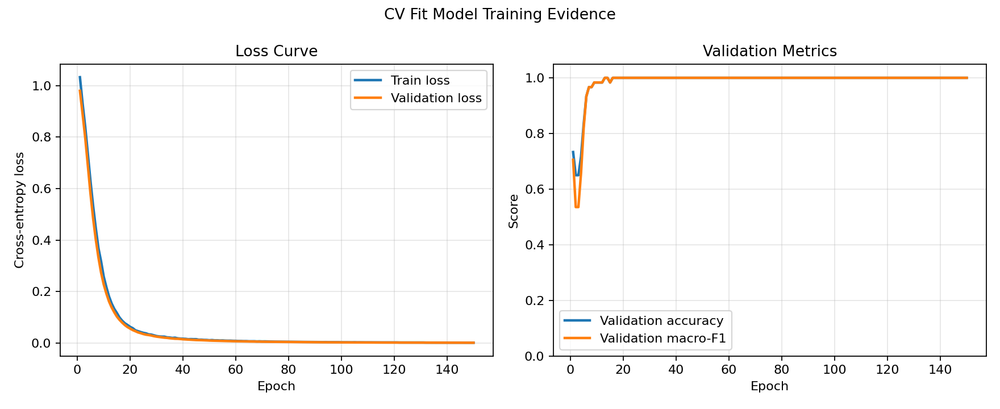

# Model Evaluation Summary

- Accuracy: 1.0000
- Macro-F1: 1.0000
- Test loss: 0.0021
- Test samples: 60
- Overfitting risk: low
- Overfitting note: training and validation curves stay close enough for this small baseline model

## Training Curves

## Per-class metrics

| Label | Precision | Recall | F1 |
| --- | ---: | ---: | ---: |
| Low | 1.0000 | 1.0000 | 1.0000 |
| Medium | 1.0000 | 1.0000 | 1.0000 |
| High | 1.0000 | 1.0000 | 1.0000 |

## Confusion Matrix

Rows are true labels and columns are predicted labels.

`[[24, 0, 0], [0, 23, 0], [0, 0, 13]]`
